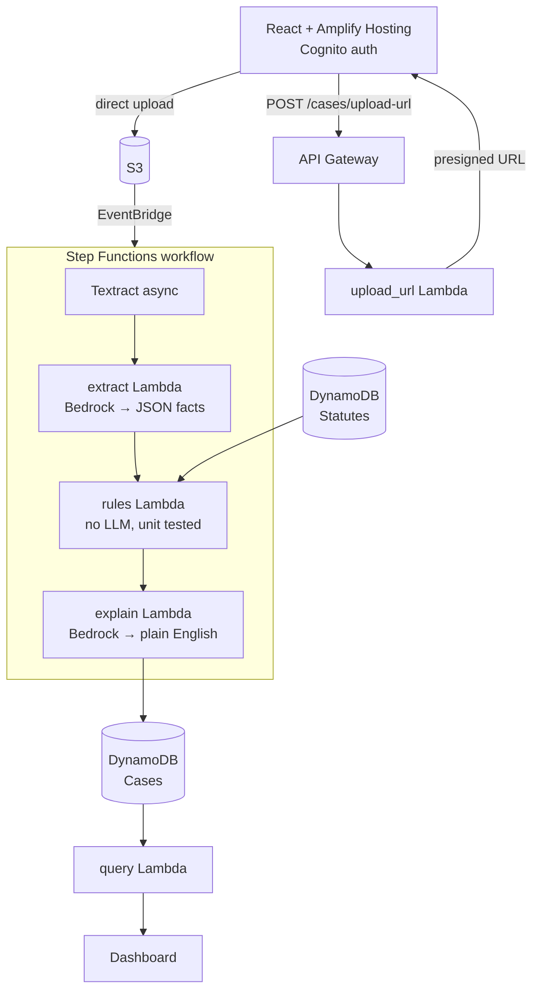

<div align="center">

# VerdictAI

**An undertrial detention checker for legal aid lawyers and Undertrial Review Committees.**

Upload a chargesheet. Get a flag if the accused has been in custody longer than the law allows.

[Live demo](#) · [Demo video (3 min)](#) · [Architecture](#architecture)

Built for [AWS First Commit](https://www.wemakedevs.org/aws/first-commit), Bharat Builds Tour · Ship It track

</div>

---

## The problem

India has roughly 50 million pending court cases, and a large share of people in prison are undertrials — not convicted of anything, waiting for a trial that hasn't finished.

Some of them have already been in custody longer than the maximum sentence they could receive if convicted. The law already entitles them to release. Nobody has the time to check case by case.

**Section 479 BNSS** (formerly Section 436A CrPC) says:

| Condition | Entitlement |
|---|---|
| Served **half** the maximum sentence | Entitled to release |
| Served **one-third**, first-time offender | Entitled to release |
| Offence punishable by **death or life imprisonment** | Provision does not apply |
| **Other cases pending** against the accused | Release under this provision is barred |

The check is arithmetic. The bottleneck is reading thousands of documents to find the dates and the charged sections.

## What VerdictAI does

1. A lawyer uploads a chargesheet or FIR (PDF or scan).
2. Textract converts it to text.
3. Bedrock **extracts facts** — charged sections, arrest date, custody status — each with the exact quote it came from.
4. A plain Python function **applies Section 479** and returns a flag.
5. A second Bedrock call explains the result in plain English.
6. The dashboard lists flagged cases sorted by days overdue, and drafts a bail application.

### The design principle

> **The LLM extracts. Code decides. The explanation step cannot change the decision.**

No model scores "urgency" or "priority". Every flag traces to a date, a statutory section, and one deterministic function that has unit tests. When the system isn't sure — a missing date, an unrecognised section, low extraction confidence — it returns `NEEDS_REVIEW` rather than guessing.

## Architecture



### Stack

| Layer | Services |
|---|---|
| **Frontend** | React + Vite + Tailwind · Amplify Hosting · Cognito |
| **API & orchestration** | API Gateway (REST) · Step Functions (Standard) · AWS SAM |
| **Compute** | Python 3.12 Lambda on arm64 · pydantic v2 · pytest |
| **AI** | Amazon Bedrock (Converse API, `temperature=0`) · Textract async · Bedrock Guardrails |
| **Data** | DynamoDB (Cases + Statutes) · S3 with encryption and a 7-day lifecycle rule |
| **Ops** | CloudWatch dashboard · billing alarm |

Everything scales to zero. There is no server, no container, and no always-on database.

### The five functions

| Function | Trigger | Responsibility |
|---|---|---|
| `upload_url` | `POST /cases/upload-url` | Creates the case record, returns a presigned S3 URL — the PDF never passes through the API |
| `extract` | Step Functions | Bedrock Converse over the document text, validated into a pydantic model |
| `rules` | Step Functions | **Decides.** No model call. Pure function |
| `explain` | Step Functions | Explains the fixed result. Cannot alter the flag |
| `query` | `GET /cases`, `GET /cases/{id}` | Serves the dashboard |

## The rule engine

The only component that decides anything. It takes extracted facts plus a statute lookup and returns a flag, days overdue, and the rule that fired.

```python
def evaluate(e: Extracted, statutes: dict[str, dict], today: date) -> RuleResult:
    if not e.arrest_date or not e.sections:
        return RuleResult(flag="NEEDS_REVIEW",
                          rule_fired="Missing arrest date or sections", ...)

    unknown = [s for s in e.sections if s not in statutes]
    if unknown:
        return RuleResult(flag="NEEDS_REVIEW",
                          rule_fired=f"Unknown section(s): {unknown}", ...)

    if any(statutes[s]["lifeOrDeath"] for s in e.sections):
        return RuleResult(flag="NOT_ELIGIBLE",
                          rule_fired="Offence punishable with death or life imprisonment", ...)

    if e.other_pending_cases:
        return RuleResult(flag="NOT_ELIGIBLE",
                          rule_fired="Other cases pending against the accused", ...)
    ...
```

`today` is a parameter rather than `date.today()`, which keeps the tests deterministic and lets any case be replayed against any date.

| Flag | Meaning |
|---|---|
| `PAST_MAX` | In custody longer than the maximum possible sentence |
| `PAST_HALF` | Past the half-sentence threshold |
| `PAST_THIRD` | Past the one-third threshold, first-time offender |
| `NOT_ELIGIBLE` | Death/life offence, or other cases pending |
| `NOT_YET` | Below every threshold |
| `NEEDS_REVIEW` | Missing data, unknown section, or low extraction confidence |

## Accuracy

Evaluated against a hand-labelled set of synthetic chargesheets, including deliberate traps: a life-imprisonment offence that looks overdue, an accused with other cases pending, and a document with missing dates.

| Metric | Result |
|---|---|
| Field-level extraction accuracy | _fill in_ |
| Flag accuracy | _fill in_ |
| Rule engine unit tests | _fill in_ passing |

Run it yourself: `python eval/run_eval.py`

## Running locally

**Prerequisites:** Python 3.12, Node 20, AWS SAM CLI, an AWS account with Bedrock model access enabled.

```bash
git clone https://github.com/<org>/verdictai.git
cd verdictai

# Backend
cd backend
pip install -r requirements.txt
pip install -e ./shared
pytest tests/ -v                 # rule engine tests, no AWS needed
sam build
sam local start-api              # http://localhost:3000

# Frontend
cd ../frontend
npm install
npm run dev
```

### Deploying

```bash
cd backend
sam deploy --guided              # pick a region where your Bedrock model is available
python scripts/seed_statutes.py  # loads the verified statute table
```

Then point Amplify Hosting at the repo; pushes to `main` deploy the frontend automatically.

## Repository layout

```
frontend/           React + Vite + Tailwind
backend/
  template.yaml     SAM: functions, API, tables, state machine
  shared/           pydantic schemas + statute lookup (installed as a Lambda layer)
  functions/        upload_url · extract · rules · explain · query
  tests/            rule engine tests + saved invoke events
data/               synthetic chargesheets, statute table, labels
prompts/            versioned extraction / explanation / bail-draft prompts
eval/               accuracy harness
docs/               STACK.md — detailed engineering notes
```

## Limitations

Stated plainly, because a legal tool that overstates itself is worse than none.

- **Not legal advice.** Output is a screening aid for a qualified lawyer, never a decision.
- **Language.** Textract does not read Devanagari or other Indian scripts. English documents are supported; other languages route to a multimodal model with lower confidence.
- **Statute coverage.** The statute table covers the most common offences under the BNS and IPC, each row carrying a source link. Sections outside it return `NEEDS_REVIEW` rather than a guess.
- **Document quality.** Poor scans reduce extraction confidence, which surfaces as `NEEDS_REVIEW` rather than a silent wrong answer.
- **Data.** Demonstrated on synthetic documents modelled on public judgments. No real case records were used.

## Privacy

Uploads are encrypted at rest and deleted after 7 days by an S3 lifecycle rule. Bedrock Guardrails mask personal information in generated explanations. Access requires a Cognito login.

## Team

| | |
|---|---|
| Frontend & deployment | _name_ |
| Backend & rule engine | _name_ |
| Data & integrations | _name_ |
| AI & legal accuracy | _name_ |

## License

MIT — see [LICENSE](LICENSE).
