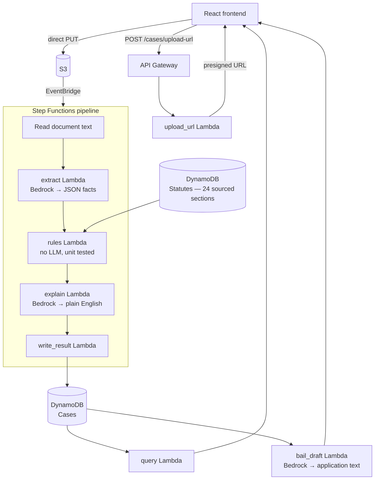

<div align="center">

# VerdictAI

**An undertrial detention checker for legal aid lawyers and Undertrial Review Committees.**

Upload a case document. Get a flag if the accused has been in custody longer than the law allows — and a ready-to-file bail application if they have.

[Live demo](#) · [Demo video (3 min)](#) · [Architecture](#architecture)

Built for [AWS First Commit](https://www.wemakedevs.org/aws/first-commit), Bharat Builds Tour · Ship It track

</div>

---

## The problem

India has roughly 50 million pending court cases, and a large share of people in prison are undertrials — not convicted of anything, waiting for a trial that hasn't finished.

Some of them have already been in custody longer than the maximum sentence they could receive if convicted. The law already entitles them to release. Nobody has the time to check case by case.

**Section 479 BNSS** (Bharatiya Nagarik Suraksha Sanhita, 2023 — formerly Section 436A CrPC) says:

| Condition | Entitlement |
|---|---|
| Served **half** the maximum sentence | Entitled to release |
| Served **one-third**, first-time offender | Entitled to release |
| Offence punishable by **death or life imprisonment** | Provision does not apply |
| **Other cases pending** against the accused | Release under this provision is barred |

The check is arithmetic. The bottleneck is reading thousands of documents to find the dates and the charged sections.

## What VerdictAI does

1. A lawyer uploads a case document.
2. The system extracts the charged sections, arrest date, and custody status — each with the exact quote it came from.
3. A plain Python function applies Section 479 and returns a flag.
4. A second AI call explains the result in plain English.
5. The dashboard lists flagged cases, sorted by days overdue.
6. For an eligible case, one click drafts a bail application citing the exact facts.

### The design principle

> **The AI extracts. Code decides. The explanation step cannot change the decision.**

No model scores "urgency" or "priority." Every flag traces to a date, a statutory section, and one deterministic function with unit tests. When the system isn't sure — a missing date, an unrecognised section, ambiguous text — it returns `NEEDS_REVIEW` rather than guessing.

## Architecture



### Stack

| Layer | Services |
|---|---|
| **API & orchestration** | API Gateway (REST) · Step Functions (Standard) · EventBridge · AWS SAM |
| **Compute** | Python 3.13 Lambda on x86_64 · pydantic v2 · pytest |
| **AI** | Amazon Bedrock — Llama 4 Maverick via cross-region inference profile (`us.meta.llama4-maverick-17b-instruct-v1:0`), `temperature=0` for extraction |
| **Data** | DynamoDB (Cases + Statutes) · S3 with encryption and a 7-day lifecycle rule |
| **Ops** | CloudWatch · IAM least-privilege per function |

Everything scales to zero. There is no server, no container, and no always-on database.

### The Lambdas

| Function | Trigger | Responsibility |
|---|---|---|
| `upload_url` | `POST /cases/upload-url` | Creates the case record, returns a presigned S3 URL |
| `textract_extract` | Step Functions | Reads the uploaded document text from S3 |
| `extract` | Step Functions | Bedrock call over the document text, validated into a pydantic schema |
| `rules` | Step Functions | **Decides.** No model call. Reads the verified statute table from DynamoDB. Pure, unit-tested function |
| `explain` | Step Functions | Explains the fixed result in plain English. Cannot alter the flag |
| `write_result` | Step Functions | Writes the final record — success or failure — back to DynamoDB |
| `query` | `GET /cases`, `GET /cases/{id}` | Serves the dashboard |
| `bail_draft` | `POST /cases/{id}/bail-draft` | Drafts a Section 479 BNSS application from the case's own facts |

## The rule engine

The only component that decides anything.

```python
def evaluate(e: Extracted, statutes: dict[str, dict], today: date) -> RuleResult:
    if not e.arrest_date or not e.sections:
        return RuleResult(flag="NEEDS_REVIEW",
                          rule_fired="Missing arrest date or sections", ...)

    unknown = [s for s in e.sections if s not in statutes]
    if unknown:
        return RuleResult(flag="NEEDS_REVIEW",
                          rule_fired=f"Unknown section(s): {unknown}", ...)

    if any(statutes[s]["lifeOrDeath"] for s in e.sections):
        return RuleResult(flag="NOT_ELIGIBLE",
                          rule_fired="Offence punishable with death or life imprisonment", ...)

    if e.other_pending_cases:
        return RuleResult(flag="NOT_ELIGIBLE",
                          rule_fired="Other cases pending against the accused", ...)
    ...
```

`today` is a parameter rather than `date.today()`, keeping the tests deterministic and every case replayable.

| Flag | Meaning |
|---|---|
| `PAST_MAX` | In custody longer than the maximum possible sentence |
| `PAST_HALF` | Past the half-sentence threshold |
| `PAST_THIRD` | Past the one-third threshold, first-time offender |
| `NOT_ELIGIBLE` | Death/life offence, or other cases pending |
| `NOT_YET` | Below every threshold |
| `NEEDS_REVIEW` | Missing data, unknown section, or low extraction confidence |

## Statute table

24 sections under the IPC and BNS, each with its cross-reference between the two codes, maximum sentence, and a source link — verifiable against the actual bill text, not looked up from a summary site. Loaded into DynamoDB with [`scripts/seed_statutes.py`](backend/scripts/seed_statutes.py).

Unknown sections don't get a guessed sentence — they return `NEEDS_REVIEW`.

## Accuracy

Evaluated end to end against six cases covering every branch the rule engine can produce: a theft case past the full maximum, past half, and past one-third (first-time offender); a murder case correctly barred despite years in custody; a case correctly barred by other pending charges; and a deliberately ambiguous document correctly flagged for human review.

| Metric | Result |
|---|---|
| Flag accuracy | **6 / 6 (100%)** |
| Branches covered | All six (`PAST_MAX`, `PAST_HALF`, `PAST_THIRD`, `NOT_ELIGIBLE` ×2 triggers, `NEEDS_REVIEW`) |
| Rule engine unit tests | 8 passing |

Run it: `python eval/run_eval.py`

## Running locally

**Prerequisites:** Python 3.13, Node 20, AWS SAM CLI, Docker (for container builds), an AWS account with Bedrock model access enabled.

```bash
git clone https://github.com/<org>/verdictai.git
cd verdictai/backend

pip install boto3 pydantic pytest
pytest tests/ -v                 # rule engine tests, no AWS needed

sam build --use-container        # required — see note below
sam deploy --guided
```

> **Always build with `--use-container`.** `pydantic`'s compiled dependency must match Lambda's Linux/x86_64 runtime; building natively on Windows or macOS produces an incompatible binary that fails silently at import time.

### Seeding the statute table

```bash
python scripts/seed_statutes.py data/statutes_extended.csv <StatutesTable-name>
```

### Frontend

```bash
cd frontend
npm install
npm run dev
```

See [`docs/FRONTEND_INTEGRATION.md`](docs/FRONTEND_INTEGRATION.md) for the full API contract — endpoints, request/response shapes, the upload-then-poll pattern, and flag values.

## Repository layout

```
backend/
  template.yaml     SAM: functions, API, tables, state machine
  shared/           pydantic schemas + statute lookup (Lambda layer)
  functions/        upload_url · textract_extract · extract · rules ·
                     explain · write_result · query · bail_draft
  tests/            rule engine unit tests
  scripts/          seed_statutes.py
  data/             statutes_extended.csv (24 sourced sections)
  eval/             run_eval.py — accuracy harness
frontend/           React + Vite
docs/               FRONTEND_INTEGRATION.md, architecture notes
```

## Limitations

Stated plainly, because a legal tool that overstates itself is worse than none.

- **Not legal advice.** Output is a screening aid for a qualified lawyer, never a decision.
- **OCR is scoped out for this build.** The pipeline reads plain text or already-digital documents directly; it does not run optical character recognition on scanned images. This is a deliberate scope decision made after an AWS account provisioning issue (a Textract subscription block outside our control), not a hidden limitation — real OCR is a straightforward addition once that clears.
- **Statute coverage.** 24 common sections under IPC and BNS, each sourced. Sections outside this table return `NEEDS_REVIEW` rather than a guess.
- **Document quality.** Ambiguous or incomplete documents surface as `NEEDS_REVIEW` rather than a silent wrong answer — confirmed by the eval's own test case.
- **Data.** Demonstrated on synthetic documents modelled on public legal provisions. No real case records were used.

## Privacy

Uploads are encrypted at rest and deleted after 7 days by an S3 lifecycle rule. Access is via the API only; no credentials are exposed to the browser beyond a short-lived presigned upload URL.

## Team

| | |
|---|---|
| Backend, rule engine, AI pipeline, infrastructure | Gaurav Kushwaha |
| Frontend & deployment | Harsh Raj Sharma |
| Data & integrations | Nitish Kumar |
| AI & legal accuracy | Dhanush Thirunavukkarasu |

## License

MIT — see [LICENSE](LICENSE).
